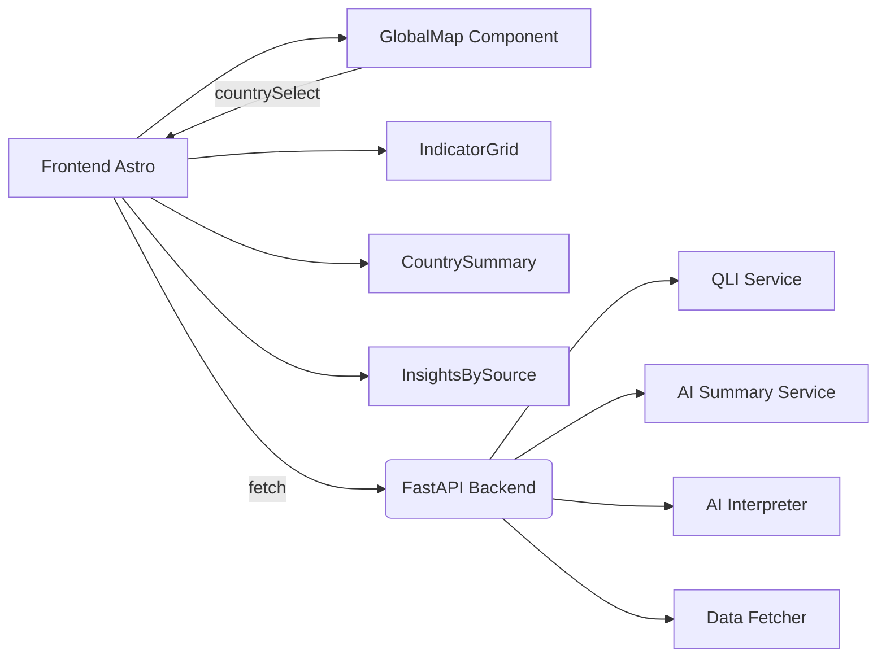

# 📘 **QualiLife AI — Plataforma de Análisis Global de Bienestar**

QualiLife AI es una plataforma de **inteligencia analítica multidimensional** diseñada para medir, comparar y explicar el bienestar global a través de datos integrados, modelado estadístico y análisis generados mediante IA.

El sistema combina:

- **Frontend interactivo en Astro + Tailwind**
- **Mapa dinámico con Leaflet**
- **Backend FastAPI con endpoints de análisis**
- **Módulos de IA para resúmenes, interpretaciones y reflexiones**
- **Un motor QLI (Quality of Life Index)**
- **Dashboards de indicadores y análisis explicados por fuentes**

---

# 🚀 **Características Principales**

### ✔️ **Mapa Global Interactivo**

- Selección dinámica de países (click o combo select).
- Renderizado con **Leaflet.js**.
- Ajuste responsivo con `ResizeObserver`.
- Panel de confirmación de país con animaciones.
- Validación automática y ajuste de límites por país (`fitBounds`).

---

### ✔️ **Análisis IA por País (Summary Engine)**

Para cada país seleccionado, la IA produce:

- **Resumen general**
- **Interpretación**
- **Reflexión**
- **QLI Global (%)**

Los textos son renderizados en tarjetas responsivas con **texto totalmente justificado**, optimizados para lectura analítica.

---

### ✔️ **Análisis por Fuentes**

Cada país incluye insights desglosados por organismos oficiales:

- World Bank
- WHO
- UNESCO
- ITU
- UNDP
- Otros

El frontend genera un **grid de tarjetas** con:

- Resumen por fuente
- Modal de detalle dinámico
- Renderizado justificado y responsive

---

### ✔️ **Indicadores por Dimensión**

El motor del backend calcula y normaliza los valores de:

- Economía
- Salud
- Seguridad
- Igualdad
- Conectividad
- Educación
- Clima

Cada indicador se visualiza mediante un componente dedicado en el frontend.

---

### ✔️ **QLI Engine**

El backend unifica múltiples fuentes en un solo índice:

```
QLI = promedio ponderado de 7 dimensiones clave
```

Cada dimensión es normalizada y explicada.
La respuesta del backend incluye:

- qli
- indicadores
- fuentes
- textos IA

---

# 🧩 **Arquitectura**



---

# 🖥️ **Frontend (Astro + Tailwind)**

### Componentes desarrollados:

- **GlobalMap.astro**

  - Mapa responsive 100% funcional
  - Confirmación visual por país
  - Ajuste dinámico y eventos globales

- **IndicatorGrid.astro**

  - KPIs por dimensión
  - Layout responsivo

- **InsightsBySource.astro**

  - Grid + modal justificado con texto IA

- **CountrySummary.astro**

  - Resumen general interpretado por IA
  - Resumen / Interpretación / Reflexión
  - Justificación precisa y tipografía optimizada

---

# 🧪 **Backend (Python + FastAPI)**

### Endpoints principales

```http
GET /qli/auto?country={name}
```

### Servicios internos:

- `qli_service.py` → cálculo de índices
- `ai_summary_service.py` → generación de análisis general
- `ai_interpreter.py` → interpretación por dimensión
- `storage_service.py` → guardado/cache
- `data_fetcher.py` → recolección de indicadores

### Tecnologías clave:

- FastAPI
- Pydantic
- TailwindCSS
- Leaflet.js
- Markdown (marked.js)
- CORS configurado para frontend Astro

---

# 📦 **Instalación**

### 🔧 Backend

```bash
cd backend
pip install -r requirements.txt
uvicorn main:app --reload
```

### 🌐 Frontend

```bash
cd frontend
npm install
npm run dev
```

---

# 🔄 **Flujo de Usuario**

1. El usuario abre la app y ve el mapa global.
2. Selecciona un país (click o select).
3. Se solicita confirmación.
4. Al confirmar:

   - Mapa colapsa
   - Se abre dashboard de análisis

5. El frontend llama a:

   ```
   GET /qli/auto?country={country}
   ```

6. Se muestran:

   - QLI Global
   - Indicadores
   - Resumen IA
   - Análisis por fuentes
   - Reflexión final

---

# 📊 **Experiencia Direccional**

QualiLife AI ofrece una experiencia de análisis integral diseñada para:

- Organismos internacionales
- Think tanks
- Gobiernos
- Investigadores
- Periodistas de datos
- Ciudadanos interesados en bienestar y desarrollo humano

---

# 📄 **Licencia**

MIT License

---

# 📞 **Contacto**

Desarrollado por **Marcelo Avila**
Ingeniero en Ciencias de la Computación – Ecuador
